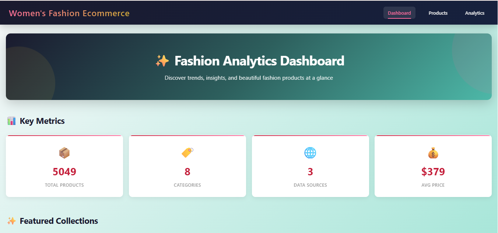
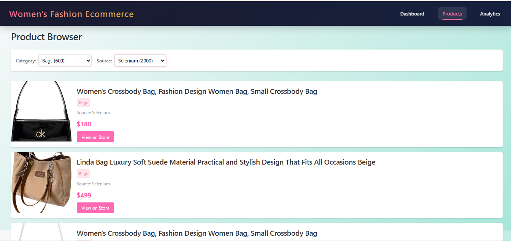
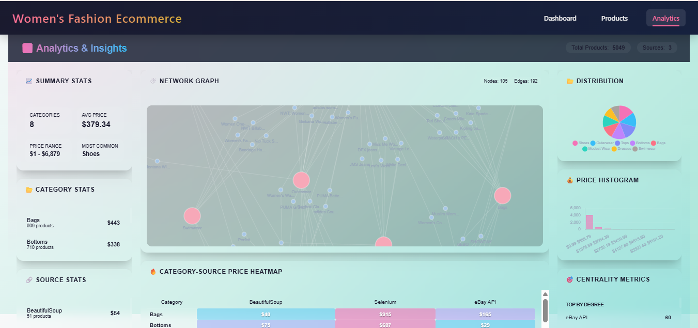

# 🛍️ Fashion E-Commerce Web Application

## 🚀 Overview
A full-stack web application designed to explore and analyze women fashion products collected from multiple e-commerce platforms.

The system integrates a modern frontend with a backend API to deliver a seamless experience for browsing, searching, and extracting insights from real-world data.

---

## ✨ What Makes This Project Stand Out
* Combines **data analysis + web development** in one system  
* Handles **real-world messy data** and transforms it into insights  
* Includes **interactive visualizations** for better understanding  
* Built with a **clean separation between frontend and backend**  

---

## 🧩 Core Features

### 🛒 Product Exploration
* Browse products with pagination  
* View product details (price, image, source)  
* Navigate across multiple categories  

### 🔎 Smart Search & Filtering
* Filter by category and data source  
* Real-time product search  

### 📊 Data Analytics
* Summary statistics and key metrics  
* Price distribution and trends  
* **Price Heatmap** for category comparison  
* **Network Graph** showing relationships between products, categories, and sources  

---

## 📸 Application Preview

### Dashboard

### Products Page

### Analytics

---

## 🛠️ Tech Stack

**Frontend**
* Angular  
* TypeScript  

**Backend**
* Flask (Python)  

**Data & Analysis**
* Pandas  
* NumPy  
* NetworkX  

---

## 🏗️ Architecture
frontend/   → User interface & interaction  
backend/    → APIs & data processing  
---

## ⚙️ Running the Project

### Backend
cd backend  
pip install -r requirements.txt  
python app.py  

### Frontend
cd frontend  
npm install  
ng serve  

---

## 🔐 Security
API credentials are removed for security purposes.

---

## 👩‍💻 Author
Rowida Sayed
